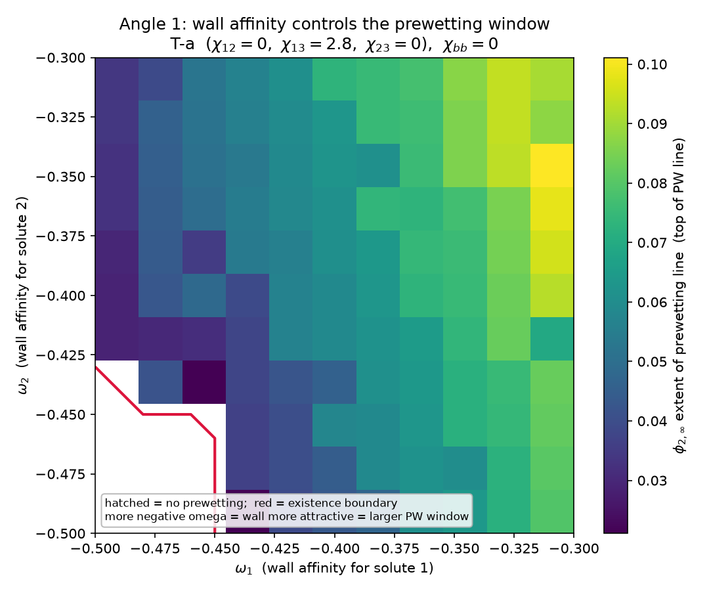

# 角度 1 — 墙面亲和 omega1 / omega2 如何影响 prewetting line

数据探索记录（服务后续物理期刊论文正文）。定性结论 + 具体数据例子；数学求解细节不在此。

## 问题

控制变量：墙面场 $\omega_1$、$\omega_2$（分别是墙对溶质 1、溶质 2 的亲和，越负越亲）。
其余固定。问：改变墙面亲和，发生 prewetting 的 line 往哪个方向移动、是更容易还是更难发生。

## 数据与指标

- 拓扑 T-a：$\chi_{12}=0$、$\chi_{13}=2.8$、$\chi_{23}=0$；$\chi_{bb}=0$（墙面二次项全零）。
- 全 $11\times11$ 的 $(\omega_1,\omega_2)$ 网格，$\omega_1,\omega_2 \in [-0.50, -0.30]$，步长 0.02，共 121 个 case。
- 指标 $\phi_{2,\infty}^{\max}$：prewetting line 沿 $\phi_{2,\infty}$ 轴的最高点，衡量 prewetting 窗口沿
  $\phi_{2,\infty}$ 的伸展；`exists`：该 case 有无 prewetting line。
- 来源：从每个 case 的 Binodal/PW 分布图（完整 overlay PNG）提 PW 像素得到（无全量数值 CSV，
  只有 12 个零散验证点）。PW line 可能多分支、用 colormap 上色，已做颜色无关提取，排除
  binodal、对角参考线、图例。标定校核：T-a $\omega_1{=}\omega_2{=}-0.30$ 提出 $\phi_{2,\infty}^{\max}=0.091$，
  与图上肉眼读数约 0.095 吻合（像素精度 $\sim\pm0.005$）。

## 结果图

颜色 = $\phi_{2,\infty}^{\max}$（越亮 = prewetting 窗口越大）；红线 = 存在 / 消失边界；
左下白区 = 无 prewetting。数据表：[figures/angle1_omega_metrics.csv](figures/angle1_omega_metrics.csv)。

统计：121 个 case 中 111 个有 prewetting、10 个无，全部落在 $\omega_1$、$\omega_2$ 都足够负的左下角。

## 物理读法

1. 墙越亲溶质，prewetting 越容易、窗口越大。$\omega$ 越负 = 墙对溶质吸引越强 → PW line 越长
   （图从左下暗到右上亮）。把亲和调弱（趋向 0），prewetting 收缩直至消失。

2. 存在一条清晰的消失边界。它落在 $\omega_1$、$\omega_2$ 都相当负的角上：只有两个亲和都太弱时才熄灭。
   例：$\omega_1 \le -0.46$ 且 $\omega_2 \le -0.46 \Rightarrow$ 无 prewetting。这回答了"何处发生 prewetting"——
   一个楔形存在区加一条边界。

   > Check: 定义出发omega绝对值越大吸附力越强，但是图片展示结果和定义冲突。我的理解是 吸附力越强，可以接受更大的浓度来对抗phi_infty

3. 各向异性：$\omega_1$ 是主控旋钮，$\omega_2$ 近乎不敏感。
   - 固定 $\omega_2=-0.30$ 扫 $\omega_1$：$\phi_{2,\infty}^{\max}$ 单调下降。

     | $\omega_1$ | $\phi_{2,\infty}^{\max}$ |
     |---|---|
     | -0.30 | 0.091 |
     | -0.34 | 0.087 |
     | -0.40 | 0.073 |
     | -0.46 | 0.052 |
     | -0.50 | 0.034 |

   - 固定 $\omega_1=-0.30$ 扫 $\omega_2$：$\phi_{2,\infty}^{\max}$ 在 $0.079$–$0.101$ 间无明显趋势（基本平）。

4. 不对称有明确来源：T-a 中 $\chi_{13}=2.8$（溶质 1 与溶剂强排斥，驱动溶质 1 在墙面富集），
   $\chi_{23}=0$（溶质 2 对溶剂中性）。所以预润湿膜本质是溶质 1 的膜，墙对溶质 1 的亲和 $\omega_1$
   才是决定旋钮，$\omega_2$ 只微调。可概括为：prewetting 由与成膜溶质对应的那个墙面场控制。

## 一句话结论

墙面亲和越强越促进 prewetting，且由成膜溶质对应的墙面场（此拓扑为 $\omega_1$）主控；
$(\omega_1,\omega_2)$ 平面上是一个楔形存在区加一条消失边界。

## 复现

- 提取模块：[src/pwpix.py](../../src/pwpix.py)；本角度脚本：[scripts/angle1_omega.py](../../scripts/angle1_omega.py)。
- 运行：`/opt/miniconda3/envs/numenv/bin/python scripts/angle1_omega.py`
  （产物写 `out/analysis/`，本记录用图已同步到 `doc/analysis/figures/`）。

你的质疑是对的 —— 墙面项和体相项在能量里确实是独立相加的，$f_{surf}$ 只含 $\omega_i \phi_i(0)$，不含任何 $\chi$。所以"$\chi$ 放大墙面吸附"这个说法在能量层面站不住。但"观测上 $\omega_1$ 比 $\omega_2$ 影响大"是真的，只是机制不是放大，而是这样：

耦合发生在体相，不在墙面。

1. 墙面项对两个溶质完全对称地起作用：$\omega_1$ 拉高 $\phi_1(0)$、$\omega_2$ 拉高 $\phi_2(0)$，各管各。这一步 $\chi$ 不参与，你说的独立性成立。
2. 但 prewetting 是不是发生，取决于墙面拉起的这个"高浓度接触层"能不能在体相里长成一层厚膜。能不能长厚膜，由体相 $W(\phi_1,\phi_2)$ 的形状决定 —— 这里才有 $\chi$。
3. T-a 里 $\chi_{13}=2.8$ 让溶质 1 有强烈的相分离/富集倾向（$W$ 沿 $\phi_1$ 方向有近乎失稳的软方向），$\chi_{23}=0$ 让溶质 2 没有。于是：
   - 墙面用 $\omega_1$ 顶起一点 $\phi_1(0)$，体相顺势把它放大成厚膜 → $\omega_1$ 一动，膜就大幅响应。
   - 墙面用 $\omega_2$ 顶起同样一点 $\phi_2(0)$，体相不接盘（$\chi_{23}=0$，没有成膜驱动）→ $\omega_2$ 动了也长不出膜，观测上"不敏感"。

一句话：$\omega$ 提供的是同一份、对称的墙面偏置；$\chi$ 不改变这份偏置，而是决定体相把哪个溶质的偏置放大成膜。放大发生在体相自由能，不在墙上。所以准确的措辞不是"$\chi$ 放大墙面吸附"，而是"$\chi$ 决定墙面偏置能否被体相接力成膜"。

关于你写进文档的那条 Check（line 39）：那是另一件事,也是对的方向。$\omega$ 越负、接触层浓度越高，确实能对抗更高的 $\phi_{\infty}$ —— 这解释的是"为什么 prewetting 窗口随 $|\omega|$ 增大而伸展"，和这里的不对称问题是两个独立的点。
