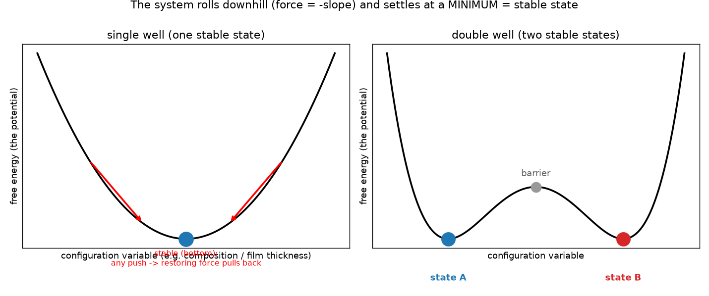

# Prewetting 入门:从自由能地形到基底上的薄/厚膜突变

## 能量、势、力、化学势

- **能量 (energy) 与 势能 (potential energy)**:能量是总称。**势能**是"由状态/位置决定的那部分能量"(区别于运动的动能)。把势能画成"某个变量的函数",就得到一条**地形曲线**(上图黑线)。

- **为什么"势能最低 = 稳态"?**(这是全篇的地基)
  1. 现实系统总有**耗散**(摩擦、与周围热浴交换),会不断把能量耗掉、往低处沉,直到再也下不去 —— 那就是**最低点**;
  2. 在最低点,任何微小偏移都让能量**升高**;而"**力 = −(势的斜率)**"永远指向下坡,于是产生一个把系统**拉回谷底的回复力**(上图红箭头)→ 稳。反之在山顶,力朝外推 → 不稳。

- **自由能 (free energy) $f$**:在**恒定温度**下(系统与周围环境不断交换热量、把温度稳住),真正被最小化的不是普通能量,而是**自由能**——它已经把"能量高低"和"熵(混乱度)"两笔账合成一笔:$f=\text{能量}-T\times\text{熵}$。
  
- **势阱 (well) / 双势阱 (double well)**:对于**自由能曲线**的一个**谷**叫**势阱 (well)**

- **化学势 (chemical potential)**  $\mu_i = \partial f/\partial \phi_i$ 描述自由能的变化，注意我们说到能量最低点时稳态，恰好这时候化学势是0，即不会再发生改变。

---

## 相分离

#### 一种物质的相分离

当前模型中，只有溶液加溶质组合，定义溶液的体积分数是$\phi_1$那么溶液体积分数就是$1-\phi_1$, 定义自由能为：

$$
f_b(\phi_1)=\phi_1\ln\phi_1+(1-\phi_1)\ln(1-\phi_1)+\chi_{1s}\phi_1(1-\phi_1)
$$

其中$\phi_1\ln\phi_1+(1-\phi_1)\ln(1-\phi_1)$ 代表混合的倾向，而$\chi_{1s}\phi_1(1-\phi_1)$代表排斥的倾向。

当出现双谷地的时候，对于固定初始值$\phi_0$溶液，会想办法分裂成两项来构造出总自由能最小的情况，值得注意的是，对于分裂后的能量，计算方法为加权求和：假设分裂为$\phi_A, \phi_B$ 两项满足合法分裂的条件$$ \phi_0=(1-\lambda)\phi_A+\lambda\phi_B $$，其总能量为：
$$
F=(1-\lambda)\,f_b(\phi_A)+\lambda\,f_b(\phi_B)
$$
因此根据数学直觉和对称性，可以选择分裂到谷地，使得总能量最低。而对于单谷地，不管怎么分裂，都比不上不分裂在谷地的值。对于大分子溶液，自由能会升级为：
$$
f_b(\phi_1)=\frac{\phi_1}{n_1}\ln\phi_1+(1-\phi_1)\ln(1-\phi_1)+\chi_{1s},\phi_1(1-\phi_1)
$$

我们构造优化问题，基于 $\phi_0=(1-\lambda)a+\lambda b$ 得到  $\lambda=\frac{\phi_0-a}{b-a}$ 则
$$
F(a,b)=(1-\lambda)f(a)+\lambda f(b)=f(a)+s,(\phi_0-a),\qquad s\equiv\frac{f(b)-f(a)}{b-a} 
$$

进行求导并使其为0：

$$
\frac{\partial F}{\partial b}=\frac{\phi_0-a}{b-a}\big(f'(b)-s\big)=0 
$$

$$
\frac{\partial F}{\partial a}=\frac{b-\phi_0}{b-a}\big(f'(a)-s\big)=0
$$

得到

$$
a<\phi_0<b\ \Rightarrow\ f'(a)=f'(b)=s=\frac{f(b)-f(a)}{b-a}
$$

#### 两种物质的相分离

现在加入第二种溶质。三种组分:溶质1、溶质2、溶剂,体积分数分别是 $\phi_1$、$\phi_2$、$\phi_s=1-\phi_1-\phi_2$，定义自由能为：

$$
f_b(\phi_1,\phi_2)=\phi_1\ln\phi_1+\phi_2\ln\phi_2+\phi_s\ln\phi_s+\chi_{1s}\phi_1\phi_s+\chi_{2s}\phi_2\phi_s+\chi_{12}\phi_1\phi_2,\qquad \phi_s=1-\phi_1-\phi_2
$$

前三项(每个 $\phi\ln\phi$)代表混合的倾向,后三项(每对 $\chi$)代表排斥的倾向。总自由能依然是平均后求和，固定初始配方 $\mathbf{\phi}_0=(\phi_{1,0},\phi_{2,0})$,现在它是平面上一个点。裂成两相 $\mathbf{a}=(a_1,a_2)$、$\mathbf{b}=(b_1,b_2)$, $b$ 相占份额 $\lambda$。合法分裂(守恒)现在是一个向量等式:

$$
\phi_0=(1-\lambda)\,\mathbf{a}+\lambda\,\mathbf{b}
$$

即

$$
F=(1-\lambda)\,f_b(\mathbf{a})+\lambda\,f_b(\mathbf{b})
$$

求解自由能达到最低:在守恒约束下对 $a,b,\lambda$ 求极小,引入 Lagrange 乘子 $\mu=(\mu_1,\mu_2)$:

$$
L=(1-\lambda)f_b(a)+\lambda f_b(b)-\mu\cdot\big[(1-\lambda)a+\lambda b-\phi_0\big]
$$

三个偏导为零:

$$
\frac{\partial L}{\partial a}=(1-\lambda)\big(\nabla f_b(a)-\mu\big)=0
$$

$$
\frac{\partial L}{\partial b}=\lambda\big(\nabla f_b(b)-\mu\big)=0
$$

$$
\frac{\partial L}{\partial \lambda}=f_b(b)-f_b(a)-\mu\cdot(b-a)=0
$$

得到共存条件(记 $\mu_i=\partial f_b/\partial\phi_i$):

$$
\mu_i(a)=\mu_i(b)\ (i=1,2),\qquad f_b(b)-f_b(a)=\sum_i\mu_i\,(b_i-a_i)
$$

## Prewetting

给溶液加一个基底(在 $z=0$ 的固体表面),远端 $z\to\infty$ 是储库,成分固定为 $\phi_\infty=(\phi_{1\infty},\phi_{2\infty})$。序参量现在是两条浓度剖面 $\phi(z)=(\phi_1(z),\phi_2(z))$,从基底一直到体相。基底会在自己表面把浓相富集成一层膜,Prewetting 就是这层贴壁浓相膜从 thin(薄)到 thick(厚)的突变。

总表面自由能是关于整条剖面 $(\phi_1(z),\phi_2(z))$ 的泛函(输入两条曲线,输出一个数):

$$
\gamma[\phi_1(z),\phi_2(z)]=\int_0^\infty\!\Big[\,W(\phi;\phi_\infty)+\sum_i\frac{\kappa_i}{2}\Big(\frac{d\phi_i}{dz}\Big)^2\Big]\,dz+f_{\mathrm{surf}}(\phi_1|_0,\phi_2|_0)
$$

三项依次是:偏离储库的体相代价 $W$、浓度陡变的界面代价(每个组分一份)、基底那一层的表面能。它们分别写作

$$
W(\phi;\phi_\infty)=f_b(\phi)-f_b(\phi_\infty)-\sum_i\mu_i(\phi_\infty)\,(\phi_i-\phi_{i\infty}),\qquad \mu_i=\frac{\partial f_b}{\partial\phi_i}
$$

$$
f_{\mathrm{surf}}(\phi_1|_0,\phi_2|_0)=\omega_1\phi_1|_0+\omega_2\phi_2|_0+\chi_{bb1}\phi_1|_0^{2}+\chi_{bb2}\phi_2|_0^{2}+\chi_{bb12}\phi_1|_0\phi_2|_0
$$

其中 $W$ 把 $f_b$ 相对储库 $\phi_\infty$ 归零($W(\phi_\infty)=0$ 且在此取最小),$\omega_i<0$ 表示基底喜欢组分 $i$,$\phi_i|_0=\phi_i(0)$ 是基底处浓度。

#### 化为关于 $L$ 的函数

泛函的自变量是两条曲线,组合太多。用一个能代表整条剖面的量——膜厚 $L$——来参数化:在"膜厚固定为 $L$"的约束下先把 $\gamma$ 对剖面取最小,记为 $\gamma(L)$;真正的平衡态再对 $L$ 取最小,即 $\min_L\gamma(L)$。

sharp-kink(强分离)近似:固定 $L$,把剖面取成

$$
(\phi_1^\beta,\phi_2^\beta)=\operatorname*{arg\,min}_{\text{dense}}W(\phi;\phi_\infty),\qquad \delta\equiv W(\phi_1^\beta,\phi_2^\beta;\phi_\infty)>0
$$

- $0\le z<L$: $(\phi_1(z),\phi_2(z))=(\phi_1^\beta,\phi_2^\beta)$
- $z=L$: 从 $(\phi_1^\beta,\phi_2^\beta)$ 突降到 $(\phi_{1\infty},\phi_{2\infty})$
- $z>L$: $(\phi_1(z),\phi_2(z))=(\phi_{1\infty},\phi_{2\infty})$

代入 $\gamma$ 得

$$
\gamma(L)=\gamma_0(L)+\delta\,L
$$

$\gamma_0(L)$ 是与 $\delta$ 无关的那部分(表面能 $f_{\mathrm{surf}}$ 加两个界面的代价及其随 $L$ 的相互作用),$\delta L$ 是膜内均匀浓相相对储库多付的体相代价,随厚度线性增长。

#### thin / thick 与临界

平衡膜厚取 $\gamma(L)$ 的全局最低点。$\gamma_0(L)$ 本身带两个谷:小 $L$ 处的 thin 谷、大 $L$ 处的 thick 谷;$\delta L$ 是一条把图整体往右上掰的直线,对大 $L$ 的 thick 谷抬得最狠。于是

- $\delta$ 大(欠饱和深、离 binodal 远):直线陡,thick 谷被抬得很高,全局最低落在 thin 谷 → thin(薄膜);
- $\delta$ 小(贴近 binodal):直线近乎平,thick 谷沉回最低,全局最低落在 thick 谷 → thick(厚膜);
- $\delta=\delta^\ast$:两谷一样深,全局最低正要从 thin 谷切换到 thick 谷 —— 这一刻就是 prewetting 转变。

控制参数($\phi_\infty$ 或基底吸附 $|\omega|$)连续变化,$\delta$ 随之连续变化;但全局最低点在越过 $\delta^\ast$ 时从 thin 谷不连续地跳到 thick 谷,平衡膜厚突变 —— 这是一次一级(first-order)面相变。

#### 相分离与 prewetting 的关系

相分离中、没有边界,$\phi_1,\phi_2$ 就是整杯溶液的均匀成分, 而加了基底之后的Prewetting背景下有了远端的概念，因此prewetting 这节里的 $\phi_1,\phi_2$ 一律指储库值 $\phi_\infty=(\phi_{1\infty},\phi_{2\infty})$ 只有基底附近的局部浓度 $\phi_i(z)$ 才随位置变。

固定一个小的 $\phi_{2\infty}$,让 $\phi_{1\infty}$ 从稀往浓一步步走(下图储库星号沿 $\phi_1$ 方向平移,底排是对应的贴壁剖面 $\phi_1(z)$):

- $\phi_\infty$ 离 binodal 远(很稀):$\delta$ 大,只有 thin 谷最低 → 基底上一层薄膜,体相均匀;
- $\phi_\infty$ 逼近 binodal:$\delta$ 变小,越过 prewetting 线的一刻 thin 谷让位给 thick 谷 → 薄膜突变厚膜(prewetting 转变),而体相此时仍然均匀;
- $\phi_\infty$ 到达 binodal:$\delta\to0$,厚膜厚度发散,体相自己也开始分层。

所以 prewetting 线住在 binodal 外侧、紧贴着它的单相区里:它是体相相分离在基底上的前兆——墙壁帮了一把,让本来还没到分层浓度的储库,提前在自己表面凑出一片浓相膜。走完全程就是:薄膜 →(跨 prewetting 线)厚膜 →(到 binodal)体相分层。

