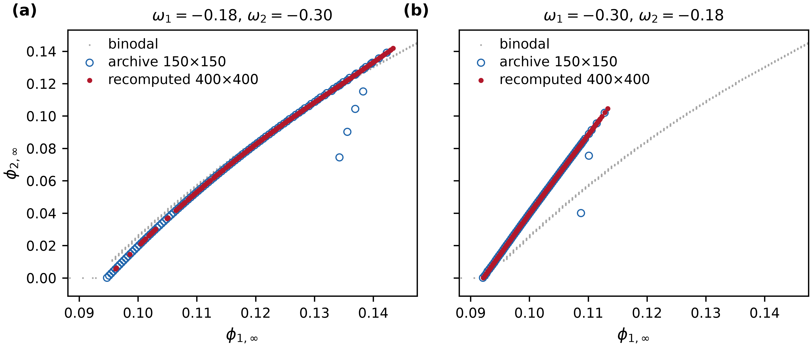

# EXP-TA-PANEL-01

## 目的

以 400×400 扫描重新计算两个 T-a 弱侧 case，改善论文相图中 re-entry 弱端的显示质量。本实验
只修复曲线采样和离群点，不改变既有物理结论。

固定参数：`chi=(0,2.8,0)`、`chibb=(0,0,0)`、`L=10`、`N=1000`、求解容差 `1e-8`。
两组 wall affinity 为 `omega=(-0.18,-0.30)` 和 `omega=(-0.30,-0.18)`。

## 结果

| case | 档案点数 | 400×400 点数 | 档案 MST 段数 | 新 MST 段数 | 档案到新线最大距离 |
|---|---:|---:|---:|---:|---:|
| `(-0.18,-0.30)` | 108 | 229 | 2 | 1 | 0.01612 |
| `(-0.30,-0.18)` | 72 | 206 | 1 | 1 | 0.00853 |

新结果沿旧档案的主线重合，同时移除了旧 150×150 数据中的稀疏离群点。第一组从两个 MST
分段恢复为一个连续分段；第二组主体不变，两个明显偏离主线的旧点不再出现。

## 文件

- `manifest.yaml`：获批参数、执行版本、时间与环境；
- `comparison.csv`：新旧点数、MST 长度、到 binodal 距离及双向最近距离；
- `archive_vs_recompute.pdf/.png`：新旧数据叠加图；
- `case_omega_m0p18_m0p30_pw_line.csv` 与 `case_omega_m0p30_m0p18_pw_line.csv`：两组新结果；
- `binodal.csv`：两组 case 共同的、逐字节相同的 binodal；
- `input_sha256.txt` 与 `conda_explicit.txt`：输入校验值和环境锁定记录。

完整运行日志保存在 AutoDL-TMP：
`/root/autodl-tmp/PrewettingPaper/runs/EXP-TA-PANEL-01/`。

首次启动因 `environment.yml` 漏列 PyYAML 而在进入求解器前停止；依赖补齐后以完全相同参数
重新运行，两组正式计算均以退出码 0 完成。失败日志也保留在上述 AutoDL-TMP 目录。
