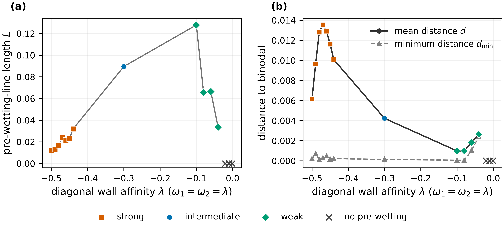
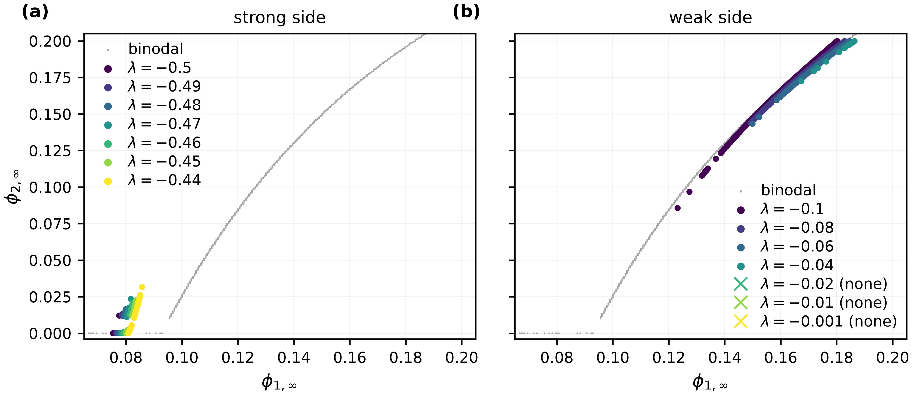

# EXP-TA-REENTRY-01

## 目的

沿 T-a 的对角 wall-affinity 路径 `omega1 = omega2 = lambda` 补齐强、弱吸引两端的展示。
实验固定 `chi=(0,2.8,0)`、`chibb=(0,0,0)`、`L=10`、`N=1000`、求解容差
`1e-8`，15 个 case 均使用 400×400 扫描和 24 个 line worker。

本实验只检验并展示论文已有的 re-entry 结论，不引入新的物理结论，也没有自动扩展获批参数范围。

## 结果

15 个 case 全部正常完成，退出码均为 0。`lambda=-0.50` 至 `-0.04` 检测到
pre-wetting crossings；`lambda=-0.02,-0.01,-0.001` 未检测到 pre-wetting。

| lambda | 点数 | MST 长度 L | 平均 binodal 距离 | 最小 binodal 距离 |
|---:|---:|---:|---:|---:|
| -0.50 | 2 | 0.01221 | 0.00617 | 0.00021 |
| -0.49 | 4 | 0.01323 | 0.00965 | 0.00072 |
| -0.48 | 10 | 0.01677 | 0.01282 | 0.00012 |
| -0.47 | 11 | 0.02369 | 0.01354 | 0.00029 |
| -0.46 | 16 | 0.02135 | 0.01291 | 0.00050 |
| -0.45 | 23 | 0.02288 | 0.01161 | 0.00018 |
| -0.44 | 35 | 0.03192 | 0.01008 | 0.00022 |
| -0.30 | 170 | 0.08958 | 0.00423 | 0.00014 |
| -0.10 | 188 | 0.12791 | 0.00098 | 0.00006 |
| -0.08 | 127 | 0.06549 | 0.00098 | 0.00006 |
| -0.06 | 78 | 0.06650 | 0.00182 | 0.00102 |
| -0.04 | 19 | 0.03347 | 0.00264 | 0.00240 |
| -0.02 | 0 | — | — | — |
| -0.01 | 0 | — | — | — |
| -0.001 | 0 | — | — | — |

## 结论守恒检查

- 强吸引侧的 line 明显收缩且采样点迅速变稀，支持强侧终止趋势。
- 弱吸引侧在 `lambda=-0.10,-0.08` 紧邻 binodal，随后 line 缩短，并在
  `lambda=-0.02` 及更弱吸引处消失，支持弱侧终止的存在。
- 但是，400×400 结果在 `lambda=-0.50` 仍找到两个彼此孤立的 crossing，因而不能直接维持
  “`lambda=-0.50` 完全没有 pre-wetting line”这一精确数值表述。
- 弱侧的全线平均距离和最小距离也没有一路单调趋零；因此不应把新指标图表述为
  `d_mean` 或 `d_min` 在终点单调趋零。相图叠加比单一距离曲线更直接地展示了 line 与
  binodal 的贴近及随后消失。

以上两项是展示措辞和证据形式的限制，不构成新的物理结论。本归档不修改论文正文，也不追加
未获批参数；主图采用指标图还是相图叠加图，应在论文整合阶段据此决定。

## 文件

- `manifest.yaml`：获批范围、数值参数、执行版本与时间；
- `reentry_metrics.csv`：每个 lambda 的存在性、长度、距离、点数、分段数和端点；
- `ta_reentry.pdf/.png`：长度与 binodal 距离指标图；
- `ta_reentry_lines.pdf/.png`：强、弱吸引侧相图叠加；
- `raw/`：15 个 case 的 `pw_line.csv`，以及共同的 `binodal.csv`；
- `input_sha256.txt`、`output_sha256.txt`、`conda_explicit.txt`：输入、输出和环境记录。

完整逐行日志保存在 AutoDL-TMP：
`/root/autodl-tmp/PrewettingPaper/runs/EXP-TA-REENTRY-01/`。
