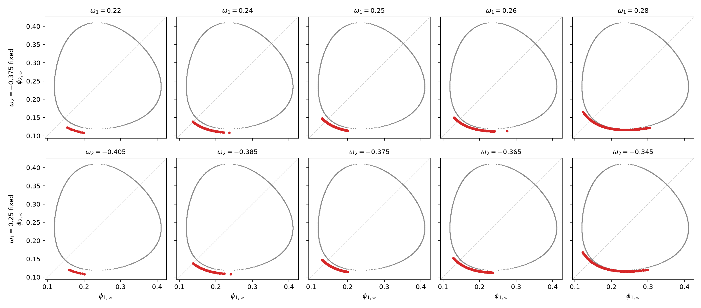
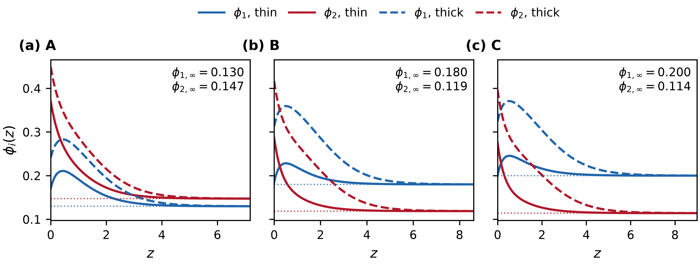
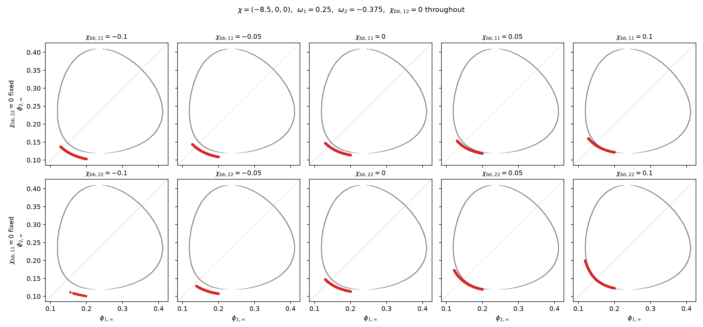

# 仅溶质吸附作用下的Prewetting存在性分析

### Prewetting Line vs Omega

在本情况下，我们分别固定吸附力项进行分析，注意在本case中，除了墙面吸附之外，Bulk Energy中只有两个溶质的吸引，除此之外溶液没有对溶质的任何倾向。所以能产生prewetting line的现象的吸附力设置是对称的，当前我们取(0.25, -0.375)为中心去分析prewetting line的变化，事实上(-0.375， 0.25) 也会存在对应的prewetting。

当固定墙面对溶质1的吸附力，随着对溶质2的吸附力逐渐变弱（绝对值变小）可以发生prewetting的远程项的浓度要求更大，但是相应可以发生prewetting的环境更多了（体现在line更长），更加靠近Binodal的曲线。当我们固定墙面对溶质2的吸附力，随着对溶质1的排斥力越强，和上述变化一致，即可以发生prewetting的远程项的浓度要求更大，但是相应可以发生prewetting的环境更多了（体现在line更长），更加靠近Binodal的曲线。减弱对溶质2的吸附和加强对溶质1的排斥在结果上呈现出一样的变化。

### Profile形状分析

在当前stage中，profile呈现出如图形状。薄膜态与厚膜态都是墙面上一高一低地吸附两种溶质。墙对两种溶质一个吸引、一个排斥，但溶质之间的吸引力很强，被排斥的溶质浓度也会被另一溶质的容度抬升起来。所以两个态里被排斥的溶质都呈现先上升后渐小的走向：紧贴墙的地方受墙的排斥，体积分数被压低；稍稍离开墙面，排斥迅速衰减，而此处被吸引的那一种溶质已经富集得很高，靠溶质间的吸引把它拉起来，形成一个不在墙上、而在墙外一小段距离处的峰值；再往外，被吸引的溶质自身降回远场组成，它失去牵引，也随之一起落下。

### Prewetting Line vs Chibb

墙面增强相互作用改变 pre-wetting 线的方式与墙面吸附力相似，线沿同样的两个趋势演化：一个是向 binodal 靠拢，一个是变长。

溶质 2 的墙面增强相互作用由负变正时，两个趋势同时出现：线长增至约 2.7 倍（弧长 0.045 至 0.119），同时贴上 binodal（到 binodal 的平均距离 0.022 降至 0.001，最近处已经接触）。溶质 1 的墙面增强相互作用只给出靠拢的趋势，线长几乎不变（0.081 与 0.084），而到 binodal 的平均距离仍单调下降（0.019 降至 0.004）。两者的差别可以从表面能读出：吸附力对墙面上的溶质含量是一次的，增强相互作用是二次的，后者只有在墙面已经聚集了该溶质时才显著。这里所取的吸附力使墙面富集溶质 2、贫化溶质 1，因此只有溶质 2 的增强相互作用有足够大的墙面含量可以作用，溶质 1 的增强相互作用改变不了线的长短，只能把线整体移近 binodal。

与吸附力的差别在于线伸展的方向，这一点在两者共同覆盖的组成范围内（溶质 1 的远场含量不超过 0.2）可以直接比出来。吸附力最强的一例与增强相互作用最强的一例沿溶质 1 方向覆盖的范围几乎相同（0.077 与 0.082），但后者沿溶质 2 方向覆盖得多得多（0.077 对 0.046），并且爬得更高（溶质 2 的远场含量到 0.200，吸附力那一例只到 0.165）。越出这一范围之后，吸附力驱动的线继续沿溶质 1 伸展（远场含量到 0.306），而溶质 2 的含量不再上升。两者放宽 prewetting 条件的方式因此不同：吸附力放宽的是溶质 1 的远场含量范围，增强相互作用放宽的是溶质 2 的。这与增强相互作用所作用的对象一致——它改变的是溶质 2 在墙面的含量，需由远场补偿的也是溶质 2。