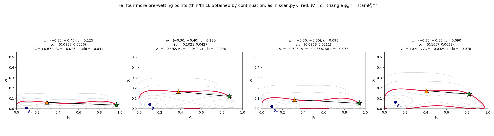

# Why the wall affinity omega governs the pre-wetting line (stage chi = (0, 2.8, 0))

## Part 1: Preliminaries

Finding pre-wetting is equivalent to solving the optimization problem: find profiles $\phi_A(z)$, $\phi_B(z)$ such that

$$
\gamma[\phi_A] - \gamma[\phi_B] = 0
$$

with $\phi_A(z)$, $\phi_B(z)$ both local minimizers.

For a two-phase problem this optimization is not directly tractable. A necessary condition is available: any $\phi_A(z)$, $\phi_B(z)$ that are local minimizers must satisfy the following ODE system.

For $z > 0$:

$$
\kappa_i \phi_i''(z) = \frac{\partial W}{\partial \phi_i}, \qquad i = 1, 2
$$

For $z = 0$:

$$
\kappa_i \phi_i'(0) = \frac{\partial f_{surf}}{\partial \phi_i(0)}, \qquad i = 1, 2
$$

From the $z > 0$ ODE, multiply each equation by $\phi_i'(z)$ and sum:

$$
\phi_1' \phi_1'' + \phi_2' \phi_2'' = \frac{\partial W}{\partial \phi_1} \phi_1' + \frac{\partial W}{\partial \phi_2} \phi_2'
$$

that is,

$$
\sum_i \frac{d}{dz}\left[ \frac{1}{2} \phi_i'^2 \right] = \frac{d}{dz} W(\phi_1(z), \phi_2(z))
$$

Integrating (as $z \to \infty$, $\phi_i' = 0$ and $W = 0$) gives the first integral:

$$
\frac{1}{2}\phi_1'(z)^2 + \frac{1}{2}\phi_2'(z)^2 = W(\phi_1(z), \phi_2(z))
$$

At $z = 0$:

$$
\frac{1}{2}\phi_1'(0)^2 + \frac{1}{2}\phi_2'(0)^2 = W(\phi_1(0), \phi_2(0))
$$

Substituting the $z = 0$ boundary condition $\phi_i'(0) = \omega_i$ (in this stage $\chi_{bb} = 0$, so $\partial f_{surf}/\partial \phi_i(0) = \omega_i$):

$$
W(\phi_1(0), \phi_2(0)) = \frac{1}{2}(\omega_1^2 + \omega_2^2)
$$

Hence any profile that satisfies pre-wetting must have its $z = 0$ values $(\phi_1(0), \phi_2(0))$ lying on the contour

$$
W(\phi_1, \phi_2) = \frac{1}{2}(\omega_1^2 + \omega_2^2)
$$

## Part 2: Linear response of the pre-wetting line to omega

Although $\gamma$ is a functional of the full profile $\phi(z)$, the profile is not a free argument here. The ODE system of Part 1 (the bulk equation for $z > 0$ together with the $z = 0$ boundary condition and the far-field condition) is a boundary-value problem, whose solution is fixed once the boundary data $(\phi_\infty, \omega)$ are given. In particular, given $\phi_\infty$ and with the branch fixed as $A$ (thin) or $B$ (thick), the profile is unique. Restricted to profiles that satisfy pre-wetting, evaluating $\gamma$ on the profile is therefore equivalent to evaluating a function of the boundary data alone, one for each branch:

$$
\gamma[\phi_A(z)] = \gamma_A(\phi_\infty; \omega)
$$

$$
\gamma[\phi_B(z)] = \gamma_B(\phi_\infty; \omega)
$$

A direct relation between the extent of the pre-wetting line (its length and its distance to the binodal) and $\omega$ is not analytically tractable. We adopt a local, differential viewpoint instead. For a fixed $\omega$, the pre-wetting line is the locus of far-field compositions $\phi_\infty$ that admit thin-thick coexistence. Assuming this locus varies continuously with $\omega$, an infinitesimal change $\omega \to \omega + \delta\omega$ induces a displacement $\delta\phi_\infty$ of each point of the line. This displacement need not be defined at every point of the initial line, but where the line responds strongly to $\omega_1$, the corresponding $\delta\phi_\infty$ is correspondingly large.

Starting from the pre-wetting condition $\gamma_A - \gamma_B = 0$, take $\omega$ and $\phi_\infty$ as the independent variables and define

$$
D(\phi_\infty; \omega) = \gamma_A(\phi_\infty; \omega) - \gamma_B(\phi_\infty; \omega)
$$

At the initial point and after the change of $\omega$, pre-wetting still holds, so $D$ remains zero:

$$
D(\phi_\infty + \delta\phi_\infty; \omega + \delta\omega) = D(\phi_\infty; \omega) = 0
$$

Expanding $D$ to first order about $(\phi_\infty; \omega)$ gives

$$
D(\phi_\infty + \delta\phi_\infty; \omega + \delta\omega) = D(\phi_\infty; \omega) + \nabla_{\phi_\infty} D \cdot \delta\phi_\infty + \frac{\partial D}{\partial \omega_1}\delta\omega_1 + \frac{\partial D}{\partial \omega_2}\delta\omega_2
$$

Since both sides equal zero, the constant term cancels and

$$
\nabla_{\phi_\infty} D \cdot \delta\phi_\infty = -\left( \frac{\partial D}{\partial \omega_1}\delta\omega_1 + \frac{\partial D}{\partial \omega_2}\delta\omega_2 \right)
$$

Let $n$ be the unit normal of the level set $D = 0$ in the $\phi_\infty$ plane,

$$
n = \nabla_{\phi_\infty} D / |\nabla_{\phi_\infty} D|
$$

and write the $\omega$-sensitivities

$$
\Delta_1 = \frac{\partial D}{\partial \omega_1}, \qquad \Delta_2 = \frac{\partial D}{\partial \omega_2}
$$

Then the normal displacement of the pre-wetting line is

$$
\delta\phi_\infty \cdot n = -\frac{1}{|\nabla_{\phi_\infty} D|}(\Delta_1 \delta\omega_1 + \Delta_2 \delta\omega_2)
$$

## Part 3: The sensitivities Delta_i and the shape of the contour

The relation above is linear in $\Delta_i$, so the strength with which $\omega_i$ drives the line is set by $\Delta_i$. By the envelope theorem, $\gamma$ depends on $\omega$ only through the surface term $f_{surf} = \sum_i \omega_i \phi_i(0)$, hence

$$
\Delta_i = \frac{\partial D}{\partial \omega_i} = \phi_i^A(0) - \phi_i^B(0)
$$

the difference in the $z = 0$ contact value of component $i$ between the thin phase ($A$) and the thick phase ($B$). The dominance of $\omega_1$ is therefore equivalent to

$$
|\phi_1^A(0) - \phi_1^B(0)| \gg |\phi_2^A(0) - \phi_2^B(0)|
$$

This inequality does not follow from the analytic structure of $W$. It is instead read from the geometry of the contour $W = c$, which Part 1 licenses: both contact points lie on the same contour

$$
W(\phi_1, \phi_2) = \frac{1}{2}(\omega_1^2 + \omega_2^2)
$$

so the segment joining them is a chord of that contour, and $(\Delta_1, \Delta_2)$ are its $(\phi_1, \phi_2)$ components.

Two assumptions constrain the chord. First, $\phi_\infty$ lies in a well of $W$, and $W = (1/2)(\omega_1^2 + \omega_2^2)$ is the large outer loop of the contour map rather than a small inner contour near a well bottom. Second, since $\phi(0)$ exceeds $\phi_\infty$ componentwise, both contact points lie on the upper branch of the loop.

These assumptions place the two points on the upper branch. The conclusion requires more: that this branch runs nearly parallel to the $\phi_1$ axis over the relevant range, so that the chord is predominantly horizontal and hence $|\Delta_1| \gg |\Delta_2|$. The shape of $W$ is fixed by $\chi = (0, 2.8, 0)$, and we have not found an analytic argument that the branch is near-horizontal; this step is left unproven. It is instead corroborated empirically: in all four cases of the figure the thin state (triangle) and thick state (star) are joined by a nearly horizontal chord whose $\phi_1$ span far exceeds its $\phi_2$ span, consistent with $\omega_1$ controlling the response of the pre-wetting line.

## Part 4: Qualitative physical picture (for the paper)

中文：

在这一拓扑下，三个体相相互作用参数中只有溶质 1 与溶剂之间的 $\chi_{13}$ 非零，溶质 1 与溶质 2、溶质 2 与溶剂的相互作用均为零，因此体相中唯一的分相驱动力是溶质 1 与溶剂的排斥，相图上的 binodal 也相应地呈现为溶质 1 与溶剂之间的相分离，分出的两相分别是富溶质 1 相和富溶剂相，而溶质 2 在哪一相里都同样自在，只是均匀地稀释在体系中。pre-wetting 的厚膜，就是在体相还未分相时，墙凭借自身的吸引提前在表面稳定出的一层富溶质 1 相，因此薄膜态与厚膜态的差别，就在于墙附近有多少溶剂被溶质 1 替换，而溶质 2 既然对溶剂和溶质 1 一视同仁，就不会偏好薄膜或厚膜中的任何一种环境，它在墙附近的含量在两个状态下几乎相同。于是，增强墙对溶质 1 的吸引会额外稳定富溶质 1 的厚膜，直接改变薄厚两态之间的竞争，pre-wetting line 随之移动；相反，增强墙对溶质 2 的吸引虽然确实让墙上多吸附一些溶质 2，但薄膜态和厚膜态多吸附的量是一样的，两个状态的能量被改变了相同的幅度，它们之间的竞争因而不受影响。所以 pre-wetting 只由 $\omega_1$ 控制，$\omega_2$ 几乎不起作用。

English:

In this topology, of the three bulk interaction parameters only $\chi_{13}$, between solute 1 and the solvent, is nonzero, while the solute 1 - solute 2 and solute 2 - solvent interactions vanish. The only driving force for bulk phase separation is therefore the repulsion between solute 1 and the solvent, and the binodal correspondingly represents demixing into a solute-1-rich phase and a solvent-rich phase, while solute 2 is equally comfortable in either phase and merely dilutes the mixture uniformly. The thick pre-wetting film is a layer of the solute-1-rich phase that the wall, through its own attraction, stabilizes at its surface before the bulk itself demixes; the difference between the thin and the thick state therefore lies in how much solvent near the wall has been replaced by solute 1, whereas solute 2, being indifferent to both the solvent and solute 1, favors neither environment, so its amount near the wall is nearly the same in the two states. Consequently, strengthening the wall's attraction to solute 1 further stabilizes the solute-1-rich thick film and directly shifts the competition between the thin and thick states, moving the pre-wetting line; by contrast, strengthening the attraction to solute 2 does draw more solute 2 to the wall, but the thin and the thick state gain the same amount, their energies are shifted by the same margin, and the competition between them is unaffected. Pre-wetting is therefore controlled by $\omega_1$ alone, and $\omega_2$ plays almost no role.
