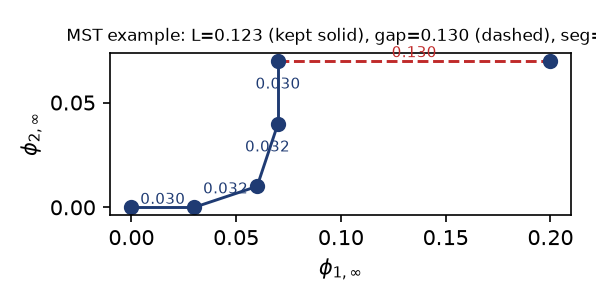
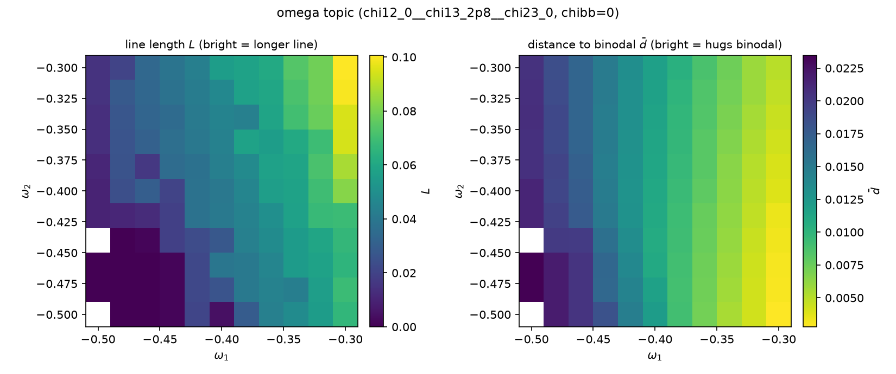

# omega topic 度量说明

数据源：pw-space/data 全库 1232 case。总表 `measures.csv`。本页对应 omega topic：T-a（chi12=0, chi13=2.8, chi23=0），chibb=0，(omega1, omega2) 平面上两个对角 11×11 块：强吸引块各 ∈[-0.50,-0.30]、弱吸引块各 ∈[-0.30,-0.10]，步长均 0.02，角点 (-0.30,-0.30) 共享，共 241 case。反对角象限（一强一弱）未采样。

## 问题

墙对两溶质的亲附力 omega1、omega2 变化时，pre-wetting 的 extent 如何变、何处熄灭。extent 分两维：pre-wetting line 的长度、line 到 binodal 的距离。

## 指标

每 case 合并全部 pre-wetting 点 $\{p_k=(\phi_{1,\infty},\phi_{2,\infty})_k\}$（不分branch），binodal 点集 $B$。均在原始平面，不归一化。长度 $L$（MST 弧长，剪空隙）：

$$
E = \mathrm{MST}\big(\{p_k\}\big),\qquad
L = \sum_{(i,j)\in E,\ \lVert p_i-p_j\rVert \le \tau} \lVert p_i - p_j \rVert,
\qquad \tau = 0.015
$$

MST（minimum spanning tree，最小生成树）：把所有点两两可连，选出一组边，把全部点连成一棵无环树，且总边长最小。直观上它沿着点的走向逐点相连、把点串成线，故其边长之和即这条线的弧长（沿弯折走，不受点疏密影响）。这里再把长度 $>\tau$ 的边剪掉——它们是跨越空隙连接分离簇的桥边，剪后剩余边长之和即"段内弧长之和、空隙不计"。

例（`mst_example.png`）：5 个点排成一条折线 + 1 个远点。实线（蓝）是 4 条段内边0.030+0.030+0.032+0.032，其和 $L=0.123$；虚线（红）0.130 是连向远点的桥边，长$>\tau=0.05$ 被剪、不计入 $L$；剪后两个连通分量，$n_{seg}=2$。

到 binodal 距离 $\bar d$（逐点最近距离取平均）：
$$
\bar d = \frac{1}{N}\sum_{k=1}^{N} \min_{b\in B}\lVert p_k - b\rVert
$$

诊断量：$n_{seg}$（剪 $\tau$ 后 MST 连通分量数）

$$
\mathrm{gap} = \sum_{\lVert p_i-p_j\rVert>\tau}\lVert p_i-p_j\rVert
$$

$$
d_{\min}=\min_k\min_{b}\lVert p_k-b\rVert
$$

$$
d_{\max}=\max_k\min_b\lVert p_k-b\rVert
$$

## 热力图

文件 `omega_length_dist.png`，两联（同一 (omega1, omega2) 网格，覆盖 -0.50..-0.10）：
左为长度 $L$，右为到 binodal 距离 $\bar d$。白格有两种来源，图上不作区分：
反对角象限的格子是未采样（无实验点）；omega1=-0.50 强吸引角的 2 格是真无
pre-wetting。注意右图 $\bar d$ 的色阶被强吸引块的大值（最大 0.0235）撑满，
弱吸引块内 $\bar d$ 的变化（0.0017..0.0071）在主图上被压缩，不影响下述结论的读取。

## 结论

体相拓扑 $\chi_{12}=0$、$\chi_{13}=2.8$、$\chi_{23}=0$。

1. omega1 主导。两幅热力图的颜色都主要沿 $\omega_1$ 方向（横向）变化、沿 $\omega_2$ 方向（纵向）几乎不变，且扩入弱吸引块后结论不变：$L$ 沿 $\omega_1$ 的变化幅度是沿 $\omega_2$ 的数倍（强吸引块约 0.074 vs 0.030，弱吸引块约 0.146 vs 0.033），$\bar d$ 同样以 $\omega_1$ 方向为主。物理意义：此拓扑下三个体相参数只有 $\chi_{13}$ 非零，体相分相的唯一驱动力是溶质 1 与溶剂的排斥，binodal 对应富溶质 1 相与富溶剂相的分离，溶质 2 在哪一相都同样自在、只是均匀稀释在体系中。pre-wetting 厚膜就是墙在体相分相之前提前在表面稳定出的一层富溶质 1 相，薄膜态与厚膜态的差别只在墙附近有多少溶剂被溶质 1 替换；溶质 2 对两种环境无偏好，其墙附近含量在两态几乎相同。于是增强墙对溶质 1 的吸引（$\omega_1$ 更负）额外稳定厚膜、直接改变薄厚两态的竞争，pre-wetting line 随之移动；增强对溶质 2 的吸引虽让墙上多吸附溶质 2，但薄厚两态多吸附的量相同、能量被等幅平移，竞争不受影响。故 pre-wetting 由 $\omega_1$ 单独控制，$\omega_2$ 几乎不起作用。数学论证（首积分给出墙面接触值所在的 $W$ 等高线、包络定理给出灵敏度即薄厚两态接触值之差、等高线上弦近水平）见同目录 omega_dominance_math.md。

2. re-enter：吸附过强与过弱都不利于 pre-wetting，但体现在两个不同的维度上。$\omega$ 对应墙的吸附力，直觉上过强或过弱都应使 pre-wetting 消亡。数据中单看每张图沿 $\omega_1$ 都是单调的（$L$ 左小右大、$\bar d$ 左大右小），没有单一标量的先增后减；原因是 pre-wetting line 的存在要求两个条件同时成立——$L > 0$（存在能触发 thin 到 thick 跳变的远场组成区间）与 $\bar d > 0$（line 与 binodal 分离，跳变先于体相共存发生），任一归零即 pre-wetting 终结，而两端各自归零的是不同的量。强吸引端由 $L \to 0$ 终结：吸引过强把薄厚之间的一级跳变推过 pre-wetting 临界点、退化为连续吸附，line 连续收缩至消失（$\omega_1=-0.50$ 强吸引角的 2 个无 pre-wetting 白格即熄灭点，逼近该角时 $L$ 平滑趋 0）。弱吸引端由 $\bar d \to 0$ 终结：偏置越弱，墙只在体相越接近共存时才诱导得出厚膜，line 整体贴向 binodal，极限 $\omega_1 \to 0$ 时并入 binodal、失去独立于共存的身份（扫描窗到 $-0.10$ 尚未到达该极限，故窗内 $\bar d$ 单调下降、同时 $L$ 因 line 沿 binodal 延伸而增大）。
